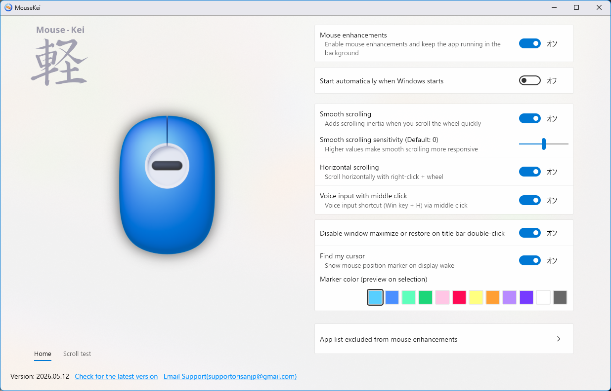

###### 日本語は下に
 

# MouseKei

#### A Windows smooth scrolling mouse utility

Smooth scrolling with added scroll inertia, along with various
features for extending mouse functionality
  

  

#### Features

* Smooth scrolling (scroll inertia)
* Horizontal scrolling
* Cancel maximize/restore on title-bar double-click
* Display a marker to help locate the mouse cursor when the display turns on
* Launch Windows Voice Typing with the mouse

##### Technologies and Implementation

* Win32 API
* WinRT
* UWP-era UI using XAML Islands
* Loading XAML files from resources
* Handle and pointer management using WIL
* Low-level mouse hook
* Raw Input
* Inter-process communication using named pipes with JSON application settings
* Saving application settings as XML using WinRT
* Registering startup tasks with Task Scheduler using COM
* XAML ViewModels, notifications, commands, and converters
* Direct Composition
* Converting PNG images to XAML images and D2D bitmaps using Windows Imaging Component (WIC)
* Application search on the taskbar

##### Project Structure

* **MouseKei**
Main project, Win32 application with WinRT
* **XAML Project**
*(The project itself is not used)*
UWP project used to define XAML UI for XAML Islands

##### Required NuGet Packages

* Microsoft.Windows.CppWinRT
* Microsoft.Windows.ImplementationLibrary (WIL)

#### License

The source code is licensed under the MIT License
The MouseKei name, logo, images, videos, and other artwork
are not covered by the MIT License
  

# MouseKei

#### Windows向けスムーススクロールマウスユーティリティ

スムーススクロールによるスクロールへの慣性付加をはじめ、
マウス操作を拡張するさまざまな機能を提供します
  

  

#### 主な機能

* スムーススクロール(スクロール慣性)
* 水平スクロール
* タイトルバーダブルクリック時の最大最小化キャンセル
* ディスプレイオン時、マウスカーソルを探すマーカー表示
* マウスでWindows音声入力の起動

##### 主な実装・使用技術

* Win32 API
* WinRT
* XAML islandsを使ったUWP世代のUI
* XAMLファイルをリソースから読み込み
* WILをつかったハンドル及びポインタ管理
* Low-level mouse hook
* Raw Input
* JSONアプリ設定ファイルの名前付きパイプでのプロセス間通信
* WinRTによる設定ファイルのXML保存
* タスクスケジューラにスタートアップ起動をCOMで登録
* XAMLビューモデル、通知、コマンド、コンバータ
* Direct Composition
* Windows Imaging Component (WIC)によるPngのXAML画像に変換及びD2Dビットマップに変換
* タスクバー上のアプリ検索

##### プロジェクト構成

* **MouseKei**
メインプロジェクト、Win32アプリWinrt
* **XAMLプロジェクト**
*(プロジェクトは使用していない)*
XAML Islandsで使用するXAML UIを定義するためのUWPプロジェクト

##### 必要なNuget

* Microsoft.Windows.CppWinRT
* Microsoft.Windows.ImplementationLibrary (WIL)

#### ライセンス

ソースコードには MIT License を適用します
MouseKei の名称、ロゴ、画像、動画などのアートワークは
MIT License の対象外です
